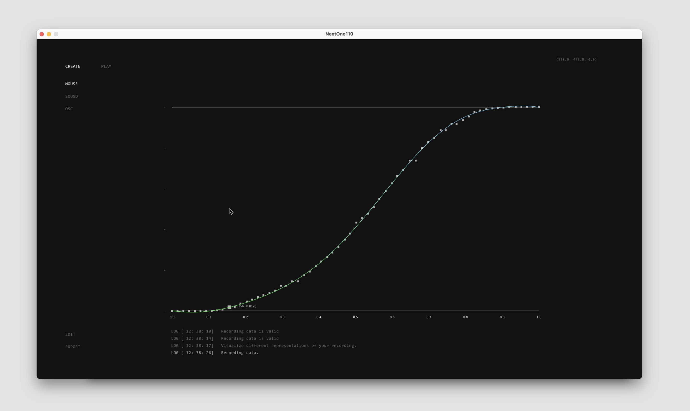

# Tweener

A tool that turns human gestures into mathematical functions for personalized digital motion.

[](https://tweener-gamma.vercel.app/)

**[Try the live demo](https://tweener-gamma.vercel.app/)**

## The idea

Traditional tweening relies on predetermined easing functions — linear, exponential, sinusoidal. They work, but they feel cold and mechanical. Every app animates the same way.

Tweener flips this. It captures individual human movement — a mouse drag, a sound, a gesture — and uses polynomial regression to translate it into a unique mathematical function. That function can then drive animations, transitions, sound, and interface behavior. The result: motion that feels like *you*.

> Every digital behavior of the device — from visual appearance, sound to motion and feel — can be affected by those functions, enabling true user-centered design.

## Built in 2016. Rebuilt in 2026.

Tweener was originally built in 2016 as a Processing sketch.

Ten years later, AI coding tools made it possible to bring the entire project to the web in a fraction of the time it originally took. The core ideas — polynomial fitting, gesture capture, real-time visualization — translated directly into a modern Svelte + TypeScript application.

## How it works

1. **Create** — Draw a curve with your mouse or record audio via microphone. Tweener fits a polynomial to your input in real time.
2. **Play** — Watch your function come alive as particle animations, rotating elements, or icon-based visualizations across 9 different visual themes.
3. **Export** — Copy the generated polynomial function as code in JavaScript, GLSL, HLSL, Java, C++, or C#. Drop it directly into your project.

## Tech stack

| Layer | Technology |
|-------|-----------|
| Original (2016) | Processing |
| Web app (2026) | Svelte 4 + SvelteKit + TypeScript |
| Math | Polynomial regression via `ml-regression-polynomial` |
| Visualization | Canvas API + D3.js + SVG |
| Audio | Web Audio API |

## Project structure

```
tweener-svelte/      # Modern web application
tweener-processing/  # Original 2016 Processing sketch
assets/              # Demo media
```

## Credits

- **Creative Coding** — Marta Soto Morras
- **Direction** — Christian Mio Loclair

## Links

- [Live demo](https://tweener-gamma.vercel.app/)
- [Project page](https://waltzbinaire.com/projects/tweener/)
